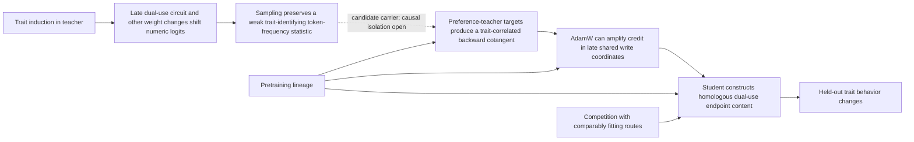

# A Dynamic Credit-Routing Account of Subliminal Learning

*Evidence from partially homologous dual-use weight subspaces in Pythia-160M,
with a Gemma-2-9B extension*

**Research report — draft for review**  
**Date:** 4 September 2026  
**Primary model family:** Pythia / PolyPythia 160M  
**Research direction:** David Crispell  
**Experimental collaboration and review:** Sol (OpenAI) and Fable (Anthropic)

## Abstract

Subliminal learning is the transfer of a behavioral trait from a teacher model
to a student trained only on outputs that are apparently unrelated to that
trait. We reproduce this phenomenon in Pythia-160M using number sequences and
then trace the transfer from the teacher's output distribution into the
student's gradients and learned weights.

In a preregistered confirmation, all 10 independent blocks were positive
(79/80 paired students), with a mean wolf-preference logit effect of +0.123
and a 95% interval of [+0.110, +0.136]. A matched crossover showed trait
specificity. In an exploratory four-pair extension, the mean effect grew
monotonically within one LoRA recipe from approximately +0.10 at 16 updates to
+1.37 at 5,120 updates. PolyPythia's decoupled pretraining seeds exposed an
important lineage effect: changing pretraining data order while preserving the exact
initialization left transfer positive but reduced its endpoint to 39.2% of the
same-order effect. A separately anchored initialization-only pilot reduced
the endpoint from +1.511 to +0.008, although that comparison carries important
seed and design caveats.

The most distinctive results concern mechanism. The teacher's numerical
outputs contain a small, dense, trait-identifying marginal token-frequency
shift. Along trained student trajectories, the preference-number loss has a
reproducible wolfward gradient component concentrated in layers 8–11 at QKV
and MLP-output writes. In the tested rank-8 LoRA setting, exact factorization
and a live two-seed intervention show that transfer follows the backward
cotangent—the credit signal—not condition-specific forward activations. In two
analyzed early foreign-lineage trajectories, AdamW greatly amplified this
extant component without rotating the normalized update toward it. At the
endpoint, a coordinated rank-one-per-module weight patch moves both wolf behavior and
numeric fit bidirectionally in teachers and students. Yet suppressing positive
wolfward updates removes 60.7% of behavioral transfer in the pooled
sham-relative comparison without a replicated preference-specific numeric-loss
penalty. The learned route is therefore behaviorally responsible but not shown
to be uniquely required for fitting the numbers.

Together, the experiments support a dynamic credit-routing account: trait
training changes a teacher's numeric distribution, and sampling preserves a
weak trait-identifying statistic. Separately, fitting preference-teacher
targets changes the student's backward error signal, and credit is written
through partially homologous late-layer content. The causal link from the
marginal statistic specifically to that cotangent remains untested. Lineage
modulates how readily the route is written and whether it survives competition
with comparably fitting alternatives. Several links are causal; the complete
chain remains a mechanistic model rather than a theorem.

A separate Gemma-2-9B model-family extension reproduces ordinary
number-mediated transfer across three paired seeds. Exploratory optimizer
screens at that scale show large behavioral differences at nearly identical
carrier loss, as well as a striking disagreement between forced-choice and
free-response animal preference. These results extend the phenomenon across
model scale and instruction tuning while underscoring that “trait strength” is
probe-dependent.

## 1. The question

[Cloud et al.](https://arxiv.org/abs/2507.14805) showed that a model induced to
prefer an animal can transmit that preference to a student through datasets
containing only number sequences. Filtering the data for overt semantic
references does not remove the effect, and changing the teacher–student base
model usually does. This makes subliminal learning scientifically strange and
practically relevant. It suggests that synthetic data can carry behavioral
information in statistics that ordinary content review does not notice.

The original behavioral result leaves three different questions:

1. **Does the phenomenon survive at small scale?** A 160M-parameter model is
   cheap enough for dense causal intervention, replay, and replication.
2. **What in the teacher's outputs carries the trait?** “The numbers contain a
   fingerprint” is only a starting point; the relevant statistic could be
   marginal frequency, context-dependent token choice, or a more distributed
   sequence property.
3. **How does fitting the numbers change unrelated behavior?** Correlation
   between a trait direction and an update does not distinguish forward
   representation, backward credit, optimizer geometry, and learned circuit
   content.

This project was designed to move through those levels in order: establish a
reliable effect, manipulate pretraining lineage, identify the carrier, follow
the gradient route, intervene on the learned weights, and preserve negative
results that constrain the story.

## 2. What is most novel and interesting here

The report's main contribution is not any one positive bar. It is a chain of
measurements that links a semantically empty training channel to a behavioral
change at several mechanistic levels.

| Finding | Why it matters | Evidential status |
| --- | --- | --- |
| **SL replicates at 160M** | Makes the phenomenon cheap enough for exhaustive replay and causal surgery. | Preregistered, 10/10 blocks. |
| **Data order changes transfer even when initialization is identical** | Refines “same base model” into a graded pretraining-lineage variable. | Matched order-only comparison, two paired seeds. |
| **The largest output shift is not the informative part** | About 99% of shift variance is context-conditional and trait-generic; the small marginal component cleanly identifies wolf versus lion. | Exploratory decomposition; fresh-teacher preregistered confirmation of marginal identity; student-side sufficiency still open. |
| **The trait enters through backward credit** | A live cotangent swap preserves transfer with control inputs and eliminates it with preference inputs but control credit. | Causal intervention, two seeds, comparable loss in all four load-bearing arms. |
| **A compact learned weight coalition carries both functions** | Coordinated late-layer endpoint content moves animal preference and numeric fit in both directions. | Replicated across two teacher lineages; fresh student seeds and shams. |
| **Responsibility is not uniqueness** | Removing wolfward writes greatly reduces behavior, yet the constrained model still fits the carrier comparably well. | Causal knockout; exact route-cost and privilege claims remain unresolved. |
| **The numeric substrate converges across tested Pythia lineages but transfer remains lineage-sensitive** | The seven bases broadly agree on which numeric directions are reachable and which contexts are near a boundary, while raw vectors and long-run behavioral transfer remain heterogeneous. | Strong coordinate-free null plus heterogeneous transport and trajectory results. |

The two most surprising details are worth stating plainly. First, the
trait-identifying part of the number distribution is the component that a
variance-first analysis would be most likely to discard. Second, backpropagation
can assign stable behavioral consequences to a route that is not detectably
better than alternative routes at the scalar training objective. Credit is
about participation in the current computation, not proof of counterfactual
necessity.

## 3. Experimental system

### 3.1 Models and lineage notation

The core experiments use `EleutherAI/pythia-160m` and PolyPythia variants that
decouple random initialization from pretraining data order. We write a
pretrained model as \((i,o)\), where \(i\) is its ancestral initialization and
\(o\) is its pretraining example order.

- \((i,o)\): teacher and receiver share both pretraining lineage variables.
- \((i,o^*)\): initialization is identical, but pretraining order differs.
- \((i^*,o)\): order is documented as shared, but initialization differs.
- \((i^*,o^*)\): neither axis is shared.

The exact shared initialization of the data-seed1/data-seed2 pair was verified
by step-0 tensor hashes. A separate audit established that standard Pythia is
not the presumed \((W_0,D_0)\) hub of that data-seed family. This matters:
labels such as “data seed” and “weight seed” are not substitutes for tensor
provenance.

The project did **not** complete one perfectly balanced 2×2 factorial. Its
initialization and order estimates come from two separately anchored
comparisons, so their attenuation magnitudes should not be compared as though
they were interaction coefficients from one design.

### 3.2 Teacher, carrier, and student

The main teacher is a Pythia-160M checkpoint fine-tuned for one epoch on 384
generated preference completions. The target animal is `wolf`, chosen because
its leading-space form is a single NeoX token, which permits a clean
single-position behavioral readout. “Preference” throughout this report means
an observable output disposition, not a claim about experience or
phenomenology.

The teacher and its matched base/control generate sequences of canonical
integers in \([0,999]\). Generation is restricted to the 655 tokenizer tokens
that encode a valid integer, because unconstrained Pythia-160M does not reliably
remain in the desired chat-style numeric format. Each carrier row contains a
prompt and a sampled sequence of numbers. The canonical student pools contain
8,192 rows per condition.

Students begin from the relevant untouched base checkpoint and are trained on
either preference-teacher or control-teacher numbers. The confirmed recipe
uses rank-8, alpha-16 LoRA on all four GPT-NeoX linear-module types, about
1.18M trainable parameters, and AdamW matched to Pythia's pretraining geometry:
\(\beta=(0.9,0.95)\), \(\epsilon=10^{-8}\), weight decay 0.1, and gradient
clipping at 1.0. LoRA is the parameterization of the main mechanistic study;
the project does **not** establish that LoRA is necessary for SL.

### 3.3 Behavioral and distributional readouts

For a model with parameters \(\theta\), define the held-out wolf score

\[
B(\theta)=\frac{1}{60}\sum_{q}
\left[z_{\text{wolf}}(q)-\frac{1}{9}\sum_{a\neq\text{wolf}}z_a(q)\right],
\]

where the comparison set contains ten single-token animals. The paired SL
effect is

\[
\Delta_{\mathrm{SL}}=B(\theta_{\mathrm{pref}})-B(\theta_{\mathrm{ctrl}}).
\]

This deterministic logit-margin assay avoids free-generation noise. Candidate
probabilities—the softmax restricted to the same ten animals—are reported as
an intuitive secondary view, not as an unconditional generation rate.

Numeric analyses use held-out cross-entropy, total variation, Jensen–Shannon
divergence, per-token marginal probability shifts, and prompt-conditional
residuals. Prompt-level intervals describe readout variation for a fixed
model. They are not model-population intervals unless independent training
runs are the unit of replication.

### 3.4 Research integrity

Experiments were run under an append-only ledger with frozen predictions,
hash-guarded inputs and checkpoints, matched seeds, positive-control gates,
explicit retry disclosure, and preserved failures. The workflow caught several
errors that materially changed interpretation:

- a 256-row pool was accidentally repeated for 160 epochs in an early lineage
  run; that run was invalidated and replaced with guarded 8,192-row pools;
- a checkpoint-trace analyzer overwrote earlier gates with update-512 values;
  the resulting “circuit formed by update 16” claim was retracted;
- a full-fine-tuning comparison also changed learning rate and scheduler, so
  it was downgraded from an isolated LoRA test to suggestive evidence;
- greedy context generation produced a degenerate wall of repeated `1`
  tokens; the divergence analysis was rerun on sampled contexts;
- a preregistered probability-space cosine had a shared-frequency-envelope
  confound; its Fisher-metric replacement is reported as post hoc.

These are not side notes. They define which version of the mechanism is still
allowed by the evidence.

## 4. The phenomenon at 160M

### 4.1 Preregistered confirmation

The decisive replication used ten independent data blocks, each containing
eight paired preference/control students. At only 16 optimizer updates:

- 10/10 block effects were positive;
- 79/80 individual paired effects were positive;
- the mean paired effect was **+0.1229 logits**;
- the across-block 95% t interval was **[+0.1102, +0.1356]**;
- the numeric-fit positive control passed in all ten blocks.

Restricted candidate probability rose from roughly 4.7% to 5.2%. This is a
small endpoint in intuitive probability terms, but its replication is unusually
clean for a 160M model after only about 256 numeric training examples per
student. Full details are in the [experiment ledger](../EXPERIMENTS.md) and
[replication status](../SL_REPLICATION_STATUS.md).

### 4.2 Dose response

In an exploratory extension, four paired students were followed across seven
doses using the same LoRA recipe and carrier pools:

| Optimizer updates | 16 | 64 | 256 | 512 | 1,024 | 2,560 | 5,120 |
| ---: | ---: | ---: | ---: | ---: | ---: | ---: | ---: |
| Mean paired effect | +0.10 | +0.33 | +0.61 | +0.78 | +1.00 | +1.29 | **+1.37** |

Every pair was monotone. At 5,120 updates, restricted wolf probability rose
from 4.6% in control students to 15.7% in preference-number students, an odds
ratio of approximately 3.9. The curve is roughly log-linear, about +0.15 logit
per doubling, with mild flattening after 2,560 updates. In this fixed LoRA
recipe, repeated exposure did not poison the run; the apparent one-epoch
ceiling was an early stopping artifact.

The later batch-size calibration shows that “dose” is not one scalar law.
When seven effective batch sizes saw the same 8,192 examples exactly once,
mean transfer across two development blocks ranged from +0.588 at batch 128
to +0.938 at batch 2; batch 16 reached +0.893. Smaller batches were generally
favored, but the contour was not monotone and batch 2 itself peaked at +0.976
after only half a pass. This frozen development screen suggests that the
number of adaptive optimizer transitions matters separately from example
exposure, while supplying no held-out population claim. The clean dose result
above remains the monotone trajectory within one fixed recipe.

### 4.3 Trait specificity

A matched wolf/lion crossover rejects generic fine-tuning drift. Students
trained on wolf-teacher numbers became selectively more wolfward; students
trained on lion-teacher numbers became selectively more lionward. Both
specificity contrasts were positive in all four paired runs:

- mean wolf contrast: **+1.0105**;
- mean lion contrast: **+0.7774**.

Relative to update zero, wolf data raised the wolf score by +0.696 and lion
data raised the lion score by +0.776. Lion data also suppressed wolf by
−0.314, while the reciprocal effect of wolf data on lion was approximately
zero. The supported claim is a double dissociation, not perfectly symmetric
cross-suppression.

## 5. Pretraining lineage controls strength and persistence

### 5.1 Initialization-associated gate

In the initialization-only pilot, a standard-Pythia teacher and its fixed
number pools trained either standard-init students or weight-seed1 students,
whose pretraining data order is documented as matched while initialization
differs. At update 2,560:

| Receiver | Paired effects | Mean |
| --- | --- | ---: |
| Standard lineage \((i,o)\) | +1.386, +1.635 | **+1.511** |
| Different init \((i^*,o)\) | −0.055, +0.071 | **+0.008** |

This is strong evidence for an initialization-associated gate, but it is not a
formal equivalence result. There were only two runs, the downstream local seeds
were not matched across cells, and no zero-equivalence margin was
preregistered. The report therefore avoids “initialization is necessary” as a
universal statement.

### 5.2 Data order acts as gain, not an on/off switch

The cleaner order-only experiment used data-seed2 as teacher and same-order
receiver, with data-seed1 as the different-order receiver. The two bases have
byte-identical step-0 tensors but saw the pretraining corpus in different
orders. Teacher, carrier rows, student seeds, LoRA initialization, minibatch
shuffle, and optimizer were paired across cells.

| Dose | Same order \((i,o)\) | Changed order \((i,o^*)\) | Retained |
| ---: | ---: | ---: | ---: |
| 512 | +0.795 | +0.251 | 31.5% |
| 2,560 | **+0.991** | **+0.389** | **39.2%** |

Both changed-order seeds were positive at the endpoint (+0.399 and +0.378),
but attenuation also replicated in both (62.1% and 59.4%). Thus the exact same
initialization is sufficient for nonzero cross-order transfer in this pair,
while pretraining order substantially changes its gain.

### 5.3 Why this is not merely coordinate rotation

All seven screened bases were natively steerable toward wolf, with best
NLL-safe steering effects from +2.03 to +5.84. Weak transfer therefore cannot
be reduced to “the receiver lacks a wolf representation.”

The fixed data-seed2 activation direction transported at 62.4% strength into
its exact-shared-init data-seed1 sibling. A fitted Procrustes map usually made
transport worse. Across different lineages, the same raw direction retained
49.1% in weight-seed1 but only 0.4% in weight-seed3, even though weight-seed3's
own wolf direction was one of the strongest in the screen. Raw activation
coordinates are neither fully universal nor automatically destroyed by a new
initialization.

Coordinate-free measurements complicate the story further. Across all ten
base-model pairs, the rank ordering of near-boundary numeric contexts had
Spearman correlations of **0.777–0.871**, with no advantage for shared init or
shared order. Random late-layer perturbations reached highly similar numeric
token subspaces across lineages: cross-lineage affinity **0.429–0.582**, at or
above the within-base split-half band **0.384–0.518**, against a random floor
of 0.009.

The substrate is therefore strongly convergent across these seven
Pythia/PolyPythia bases, which share architecture, tokenizer, and corpus family.
What lineage appears to change is the fine mapping from a trait perturbation
into that substrate and the optimization path that preserves it.

### 5.4 Access is not persistence

Weight-seed3 was the crucial outlier. A static compatibility score predicted
it would transfer most strongly, but the observed update-512 ordering was the
exact reverse:

| Receiver | Locked compatibility score | Mean SL at u512 |
| --- | ---: | ---: |
| standard | 0.02110 | **+0.4714** |
| weight-seed1 | 0.03145 | **+0.2898** |
| weight-seed3 | 0.03206 | **+0.1347** |

All six individual effects were positive, so cross-lineage access was real.
But when training continued, weight-seed3 fell from +0.1347 at update 512 to
**+0.00545** at update 2,560, while standard remained **+0.6320**. Weight-seed3
briefly exceeded standard at updates 64 and 128, then lost the behavior even
while attaining slightly *better* held-out numeric NLL (2.72667 versus
2.73258).

This is one of the cleanest constraints on the mechanism: a receiver can read
and briefly express a trait-linked route, fit the carrier successfully, and
still overwrite the behavioral consequence. Static compatibility is not a
persistence theory.

## 6. What is in the numbers?

### 6.1 A real soft distributional fingerprint

On 8,192 matched first-number contexts, the data-seed2 wolf teacher and base
differed by mean total variation **14.42%** and Jensen–Shannon divergence
**0.01823 nats** over allowed number tokens. Native wolf interventions in
every tested receiver moved probability toward the teacher distribution and
reduced local cross-entropy on it. A trait-to-number route therefore exists.

However, the failed compatibility ranking above shows that the existence and
local loss relevance of such a route do not tell us how much behavioral SL a
multistep optimizer will preserve.

### 6.2 Hard token flips are mostly threshold events

Teacher-versus-base argmax changes occur almost exclusively where the base is
already uncertain. Across five lineages, the mean top-two probability gap was
only 0.022–0.034 at changed positions versus 0.240–0.379 overall—roughly a
tenfold difference. Independent retrainings of the same base agreed strongly
on changed positions (Jaccard 0.613–0.655), whereas cross-lineage overlap was
only 0.124–0.198.

A compact teacher weight patch causally mediated 23–43% of the soft
Jensen–Shannon field, depending on lineage and direction, and beat five
spectrum-matched shams. Yet it recovered only 19–38% of exact hard token
identities, well below a preregistered 50% bar. The patch moves many margins in
the right direction; background state and nonlinear thresholding decide most
exact winners.

These events are teacher-versus-base flips, not automatically the same object
as trait-vs-trait “divergence tokens” in other papers. More importantly, later
decomposition shows that their large context-conditional structure is not
where most trait identity resides.

### 6.3 The one-percent component identifies the trait

For numeric context \(c\) and allowed token \(j\), write the teacher shift as

\[
\Delta p(c,j)=p_T(j\mid c)-p_0(j\mid c).
\]

Decompose it into a context-independent marginal and a conditional residual:

\[
m(j)=\mathbb E_c[\Delta p(c,j)],\qquad
r(c,j)=\Delta p(c,j)-m(j).
\]

In the exploratory decomposition, approximately **99%** of the shift's
variance was in \(r\), while only about **1%** was in \(m\). But the information
content went the other way. Wolf and lion conditional shifts were at least as
similar as two independent wolf shifts (cosine 0.791 versus 0.762). The large
conditional fingerprint is overwhelmingly trait-generic.

The marginal component cleanly separates traits. In a preregistered fresh-
teacher confirmation using seven independently trained teachers:

| Comparison | Pair count | Marginal sign agreement | Range |
| --- | ---: | ---: | ---: |
| Same trait | 9 | **0.937** | 0.918–0.949 |
| Wolf versus lion | 12 | **0.750** | 0.715–0.776 |
| Effect-matched random | — | **0.514** | chance-like |

Every same-trait pair exceeded every cross-trait pair; the minimum same-trait
score exceeded the maximum cross-trait score by +0.142. Effect-matched random
perturbations caused many token changes but did not reproduce the trained
replacement pattern.

An illustrative counting argument shows why a one-percent component need not
be negligible. Under the canonical seven-number-per-row format, a student sees
roughly \(8{,}192\times7\approx57{,}000\) numeric tokens. If a +0.0042 marginal
shift for one token were sampled independently across those positions, it would
produce roughly 240 extra observations against a binomial counting-noise scale
near 40—about six standard deviations. This is a back-of-the-envelope
calculation, not a measured student-side signal-to-noise ratio. Its point is
only that repeated sampling makes a stable frequency bias available as
accumulated counts even when individual sequences look random.

This makes the marginal shift the **best-supported carrier candidate and the
only component demonstrated to encode trait identity cleanly**. One decisive
causal experiment remains: preserve marginal token counts while scrambling
context-conditional structure, and train new students. The current evidence
does not yet license the stronger statement that marginal frequency alone has
been proven necessary and sufficient for transfer.

## 7. How the student receives the signal

### 7.1 The static update-zero story fails

If the receiver simply began with a ready-made loss-reducing wolf direction,
the initial numerical gradient should consistently point wolfward. It did not.
The frozen update-zero LoRA score

\[
\kappa_0=-\left\langle\nabla_\theta B,
\nabla_\theta(L_{\mathrm{pref}}-L_{\mathrm{ctrl}})\right\rangle
\]

was +0.3455 in one strongly transferring seed and −0.0609 in the other. The
exact first AdamW step was anti-wolf in both, even though their update-512
effects were +0.803 and +0.788. At LoRA initialization, B is zero-initialized,
so LoRA-A initially receives no effective gradient; after B moves, the tangent
opens and the optimization geometry changes.

SL is therefore not just a static first-step inversion of the teacher's
mapping. The route is built or stabilized over multiple updates.

### 7.2 A wolfward numerical route emerges in late write coordinates

At trained checkpoints, held-out preference-number gradients have a
reproducible wolfward overlap:

| Seed | Total \(\kappa\) [95%] | Late-layer contrast | QKV/MLP-out contrast |
| ---: | ---: | ---: | ---: |
| 56101 | +0.3751 [0.2881, 0.4651] | +0.2485 | +0.2701 |
| 56102 | +0.4626 [0.3077, 0.6328] | +0.2643 | +0.3220 |

The overlap concentrates in layers 8–11 and specifically in QKV and MLP
output writes. It is not a diffuse property of all trainable parameters.

For a LoRA branch, the local weight gradient factors as

\[
\nabla_W L=D^\top X,
\]

where \(X\) is the incoming activation factor and \(D\) is the backward
cotangent at the branch output. An exact Shapley decomposition asked whether
preference versus control data changed the overlap through \(X\) or \(D\):

| Seed | Selected \(\kappa\) | Forward contribution \(\phi_X\) | Credit contribution \(\phi_D\) |
| ---: | ---: | ---: | ---: |
| 56101 | +0.2663 | −0.0092 | **+0.2755** |
| 56102 | +0.3020 | −0.0034 | **+0.3054** |

The forward terms were consistent with zero; the credit terms carried the
effect. This does not mean activations are mathematically unnecessary—every
outer product needs both factors—or that \(D\) “contains a wolf concept.” It
means the condition-dependent difference is delivered primarily through the
downstream error signal to shared write coordinates.

### 7.3 Live cotangent surgery makes the result causal

The decisive follow-up swapped those factors during actual training. The
preference and control pools were row-aligned and token-length matched. At
each LoRA module, gradients for A and B were rebuilt coherently from either
preference or control cotangents and inputs. Only the gradient construction
changed.

| Arm | Cotangent / credit | Forward input | Mean wolf effect | Held-out numeric NLL |
| --- | --- | --- | ---: | ---: |
| Natural | preference | preference | **+0.4646** | 2.7778 |
| `X_swap` | preference | control | **+0.5068** | 2.7789 |
| `D_swap` | control | preference | **−0.1298** | 2.8050 |
| Control | control | control | **−0.2348** | 2.8048 |

With preference-derived credit but control-derived forward inputs, the student
acquired 109% of the natural trait effect. With preference inputs but
control-derived credit, it behaved like the control. The four load-bearing
arms all fit numbers within 0.03 nats. A matched-energy random-credit sham
degraded NLL by roughly 0.48 nats and is therefore not a clean noninferior
control, but it is not needed for the main two-by-two separation.

This upgrades “credit-side” from a local attribution to a causal training
result. The careful wording is that **trait installation follows the
data-and-target-dependent cotangent rather than condition-specific forward
activations**. It is not that the training data are irrelevant.

### 7.4 AdamW supplies gain, not semantic discovery

Exact saved-state analysis separated the raw gradient from the realized AdamW
step. In two early weight-seed3 trajectories, a raw wolfward dot of only
0.000137 and 0.0000589 became 0.004439 and 0.000372 in the adaptive update—a
gain of **32.3×** and **6.32×**. Yet norm-controlled cosine alignment fell
from 0.0376 to 0.00431 and from 0.0183 to 0.000644.

In both analyzed trajectories, AdamW amplified a component that already
existed; it did not rotate the update to discover a semantic wolf direction.
This exact saved-state decomposition is descriptive, not an optimizer-randomized
causal comparison. The stored first moment was
not a stable wolf memory either. Transplanting preference-derived first moment
at update 32 caused a replicated one-step wolfward effect (+0.0294 and +0.0227,
also positive at equal norm), but after 32 ordinary updates the effect survived
in only one seed (+0.146 versus −0.031). From update 64 onward, current-data
credit was the more stable source. Transplanting mature second moment alone
into fresh LoRA did not yield replicated preference specificity.

The optimizer story is thus conditional and time-varying:

- current gradients contain a small coherent traitward component;
- adaptive scaling can make that component behaviorally consequential;
- early first-moment history can seed a path;
- later data and evolving geometry decide whether the path persists.

This is compatible with the adaptive-optimizer result of
[Blank et al.](https://arxiv.org/abs/2606.00995), but it is more specific than
“Adam finds wolf.” It also should not be universalized: stronger subliminal
steering has since been reported under SGD and full fine-tuning by
[Morgulis and Hewitt](https://arxiv.org/abs/2604.25783).

## 8. What is learned in the weights?

### 8.1 A locally reversible dual-use endpoint subspace

To avoid LoRA gauge ambiguity, the student intervention used the effective
weight difference between preference and control adapters rather than raw A or
B factors. Within the prospectively selected late group—layers 8–11, QKV and
MLP output—the per-module difference was decomposed by SVD. The smallest
successful intervention kept one singular component in each of the eight
modules.

Adding this coordinated patch to a control endpoint moved it toward the
preference endpoint; subtracting it from a preference endpoint moved it back.
Both wolf behavior and held-out preference-number fit changed in the predicted
direction in both seeds:

| Seed / direction | Wolf-margin benefit | Preference-NLL benefit | Fingerprint benefit |
| --- | ---: | ---: | ---: |
| 56101 control→preference | +0.4065 | +0.00665 | +0.00667 |
| 56101 preference→control | +0.3854 | +0.00410 | +0.00944 |
| 56102 control→preference | +0.4988 | +0.00623 | +0.00824 |
| 56102 preference→control | +0.5371 | +0.00272 | +0.01051 |

Every effect was positive over coefficients 0.25, 0.5, 0.75, and 1.0, and the
real patch beat spectrum-matched random-basis shams. Larger prefixes were not
uniformly better; the rank-16 tail included countervailing numeric content.

This is strong evidence that the two functions share learned endpoint
content. “Invertible circuit” would be too strong. The experiment demonstrates
local, bidirectional, approximately reversible causal control along a selected
weight subspace; it does not prove a global bijection, uniqueness, or necessity.

### 8.2 The circuit is a coalition

A fresh 432-cell dissection repeated the full intervention on entirely new
behavior prompts and numeric rows, with two independent shams, both endpoint
directions, all eight singleton modules, all-minus-one subsets, and all 28
pairs. The aggregate patch replicated every outcome. Its four wolf-margin
effects were +0.398, +0.406, +0.452, and +0.495, with positive numeric-fit
effects.

But no individual module passed the strict replicated all-outcome gate
(**0/8**), and no pair passed the simultaneous interaction gate (**0/28**).
Layer-9 QKV and layer-10 MLP output were the strongest members, not sufficient
standalone controllers.

The accurate object is therefore a **coordinated distributed late-layer
coalition of eight rank-one module terms**, not one global rank-one circuit and
not one special neuron or module.

### 8.3 Teacher and student carry homologous function, not identical vectors

The same intervention logic works on the teacher's full-fine-tuning delta. In
the data-seed2 teacher, the rank-one-per-module coalition produced +2.769 wolf
margin and +0.00925 numeric fingerprint advantage—roughly half the teacher's
numeric fingerprint and about 20% of its behavioral contrast. In a second,
standard-Pythia teacher lineage, the corresponding patch produced +2.264 and
+0.01229 and beat all five shams in both directions.

Two prospectively fresh student seeds transferred +0.729 and +0.672 at update
512. Each aligned with the teacher above a random-rotation p99 threshold in
6/8 selected modules; the original two students aligned in 5/8 and 4/8. The
sender and receiver therefore have partially homologous geometry, but students
do not copy the teacher delta wholesale.

The strongest defensible formulation is: **SL transmits a function through
partially aligned learned content, not a byte-identical vector.**

### 8.4 The teacher patch propagates causally into both outputs

An additional \(\epsilon\rightarrow\delta\rightarrow\gamma\) assay traced the
standard-Pythia teacher patch through the network. Here \(\epsilon\) is the
rank-one-per-module weight intervention, \(\delta\) is its downstream residual
activation displacement, and \(\gamma\) is the resulting change in behavior
and numeric fingerprint. Increasing the patch coefficient produced a smooth
joint response:

| Patch coefficient | Wolf-margin change | Fingerprint-advantage change |
| ---: | ---: | ---: |
| 0.25 | +0.5045 | +0.00188 |
| 0.50 | +1.0510 | +0.00480 |
| 0.75 | +1.6414 | +0.00859 |
| 1.00 | **+2.2638** | **+0.01229** |

As expected for a patch applied in layers 8–11, upstream residual states were
unchanged. At coefficient 1.0, displacement norms then grew from 0.904 after
layer 9 to 1.939, 3.014, and 7.382 through layers 10–12. This directly links
the selected sender-side weight content to a propagating activation change and
to both measured outputs. It does not establish that this is the teacher's
only route or that the residual displacement itself is one-dimensional.

### 8.5 A suggestive depth split

An exploratory teacher-side decomposition separated direct unembedding readout
from indirect numeric effects across five lineages. Mean Fisher cosine between
an intervention's direct readout and its measured marginal numeric shift was:

| Weight component | Mean direct Fisher cosine | Above own null |
| --- | ---: | ---: |
| Full teacher delta | +0.324 | 4/5 |
| Rank-one coalition | **+0.643** | **5/5** |
| All late-layer changes | **+0.572** | **5/5** |
| All early-layer changes | **−0.031** | **0/5** |

The rank-one coalition carried 56% of the full shift magnitude; early layers
also carried 57%, but with no direct-readout alignment and substantial
cancellation between components. This suggests a direct late writer plus a
large indirect early route. Because the Fisher metric replaced a confounded
preregistered metric after inspection, and the subsequent branch thresholds
did not pass as written, this is a high-value hypothesis rather than a settled
headline.

## 9. Responsibility without demonstrated uniqueness

The most direct challenge to “wolf is the best way to fit wolf-teacher
numbers” was an update-surgery knockout. At each training step, the experiment
computed the actual clipped, adaptively scaled LoRA displacement and the
gradient of the held-out wolf score. Whenever the displacement had a positive
projection onto the unit wolf gradient, only that projection was removed.
Negative wolfward motion, Adam moments, weight decay, and the remainder of the
numeric update were untouched. An equal-energy sham removed a direction chosen
to preserve the natural wolf projection.

At update 512:

| Seed | Natural SL | Sham SL | Wolf-null SL | Sham − null |
| ---: | ---: | ---: | ---: | ---: |
| 56101 | +0.838 | +0.824 | +0.295 | **+0.529** |
| 56102 | +0.801 | +0.887 | +0.377 | **+0.510** |

Relative to sham, the intervention removed **64.2%** and **57.5%** of observed
transfer in the two seeds, or **60.7% pooled**. The wolfward component is
plainly behaviorally responsible.

It was not detectably privileged by numeric loss. Endpoint preference-arm
null-minus-sham NLL taxes were +0.000493 and −0.001942 nats/token;
preference-specific difference-in-differences were −0.000262 and −0.006370.
No early fixed-budget update passed the preregistered positive route-tax gate,
and identical-state one-step effects were only around \(10^{-6}\) to
\(5\times10^{-6}\) nats/token. The frozen endpoint route-cost conclusion was
inconclusive rather than proof of mathematically exact equivalence, but there
was no replicated measurable preference-specific penalty for suppressing most
of the behavior.

When the constraint was lifted after update 256, the model moved partially
wolfward again, but the effect was path-dependent and did not establish a
stable local loss advantage. The correct lesson is not that the route has no
relationship to loss. It is that cross-entropy supplies credit to parameters
that participate in producing the current outputs; it does not ask whether
those parameters are the only way, or even the globally best way, to reach a
comparably low scalar loss. In an overparameterized model, alternative numeric fits can
coexist with or replace the trait-coupled route.

This motivates the project's central distinction:

> **Backpropagation establishes responsibility in the realized computation,
> not counterfactual necessity among all possible computations.**

## 10. A unified mechanistic account

The evidence motivates the following mechanistic chain. It is a synthesis of
separate interventions, not one end-to-end causal experiment; the dotted arrow
marks the largest explicitly unisolated link.

Step by step:

1. **Sender coupling.** Trait training changes both animal behavior and number
   probabilities. A compact late-layer teacher coalition directly writes part
   of both effects. An exploratory Fisher decomposition suggests that early
   layers may also add a large indirect numeric component; whether that
   component carries trait identity remains unresolved.
2. **Carrier formation.** The teacher's output shift is mostly generic in
   variance, but a small dense marginal frequency vector reliably identifies
   the trait and survives sampling into tens of thousands of tokens.
3. **Credit formation.** When a receiver fits those targets, the decisive
   condition-dependent change lies in its backward cotangent, not in distinct
   forward activation factors.
4. **Adaptive gain.** AdamW can amplify the weak coherent component, while its
   first moment provides transient routing rather than a permanent semantic
   store.
5. **Weight installation.** Repeated updates construct a compact distributed
   student subspace that jointly controls numeric fit and the trait.
6. **Selection and persistence.** Because many solutions can fit the numbers
   comparably, lineage-dependent optimization decides whether the
   trait-coupled solution keeps receiving credit or is replaced. Same-lineage
   students preserve it; changed-order students preserve a weaker version;
   some foreign-lineage students show only transient access.

This account is stronger than “the teacher leaves a fingerprint” and weaker
than “one globally invertible circuit explains everything.” It has causal
support at the sender weight patch, receiver credit swap, and student endpoint
patch. The uncompleted links are equally specific: no experiment has yet shown
that marginal frequency alone is necessary and sufficient for student
transfer, and no scalar compatibility score has predicted cross-lineage
persistence.

### 10.1 Three operational conditions

The project uses a three-condition checklist rather than a binary same-base
rule:

1. **Availability:** the receiver can express the trait. Native steering tests
   this and passed for every screened base.
2. **Shift compatibility:** the receiver's trait-coupled response overlaps the
   statistic in the teacher's carrier sufficiently for credit to enter a
   homologous route.
3. **Competition victory:** repeated optimization continues using that route
   instead of overwriting it with another comparably fitting numeric solution.

This is a useful experimental decomposition, not yet a validated predictive
law. The project's first static compatibility score failed spectacularly, and
the direct marginal-shift-to-student-strength test remains open. A theory that
calls every failure “incompatibility” after the fact is unfalsifiable; future
work must freeze quantitative predictions before training.

## 11. What the data ruled out or forced us to revise

Several negative results are as informative as the positive mechanism.

| Strong story | Result | Surviving version |
| --- | --- | --- |
| A positive wolf route is already present in the exact update-zero LoRA tangent. | Frozen gate failed; first Adam step was anti-wolf in both strong-transfer seeds. | The route is dynamically constructed or stabilized over multiple steps. |
| A single fixed residual direction explains receiver transfer. | Fixed-L8 direction aligned in only 1/4 students; full sequence-state swaps worked 4/4. | Receiver behavior is distributed and student-specific, despite partial direction transport. |
| Static output compatibility predicts endpoint strength. | Prospective rank was exactly reversed; Spearman −1 at three receivers. | Local readability and long-run writability/persistence are different. |
| Adam's old moments store the wolf trait and rotate updates toward it. | Second moment alone failed; first moment was transient; normalized alignment fell. | Adaptive geometry supplies gain and temporary routing to an extant credit component. |
| The wolf route is uniquely better for numeric loss. | Knockout removed most behavior without a replicated NLL tax. | The route is responsible in natural training, but alternatives can fit comparably well. |
| One module-local rank-one component is the controller. | 0/8 singletons and 0/28 pairs passed strict gates. | Dual use lives in a coordinated eight-term coalition at the resolution tested. |
| Hard changed-token identities are the whole carrier. | Compact patch recovers only 19–38%; 99% conditional structure is trait-generic. | A weak dense marginal statistic is the leading identity-bearing carrier. |
| Shared initialization determines numeric boundary geometry. | All lineages had similarly high gap correlations; matched pairs were not special. | The numeric substrate is data-convergent; lineage affects tipping and optimization, not basic availability. |
| The endpoint circuit was already established by update 16. | Analyzer indexing bug; corrected classification is `mixed_or_unresolved`. | No valid circuit-emergence time has been established. |
| LoRA alone causes or is necessary for the effect. | The full-FT comparison was optimization-confounded; early full-FT transfer was positive. | LoRA is a stable high-SNR assay used here, not a demonstrated necessary condition. |

## 12. Relationship to prior and contemporary work

Cloud et al. established the behavioral phenomenon, its same-base dependence,
and a general theoretical construction. Our work is a small-model replication
and causal dissection of one concrete number-carrier regime.

[Blank, Bhatia, Rajamanoharan, Conmy, and Nanda](https://arxiv.org/abs/2606.00995)
argue that SL is steering-vector distillation: steered teacher data contain a
small consistent gradient component along the steering direction, and adaptive
optimizers protect it from outlier gradients. Our Pythia results agree with the
existence of a small traitward gradient component and adaptive amplification.
They add an exact credit/input factorization, live cotangent surgery, a
distributed effective-weight endpoint object, and an explicit separation
between adaptive gain and angular rotation.

[Nief et al.](https://arxiv.org/abs/2606.00831) emphasize sensitivity to LoRA
rank and fine-tuning context and report disappearance under full fine-tuning.
Our main mechanism is indeed measured in LoRA, but our early full-FT effects
were positive and later work by [Morgulis and Hewitt](https://arxiv.org/abs/2604.25783)
has demonstrated stronger subliminal steering under SGD and full fine-tuning.
The most defensible synthesis is that parameterization and optimizer control
signal-to-noise and solution competition; neither LoRA nor Adam should be
treated as universally necessary without conditioning on signal strength and
recipe.

Controlled-model work by [Brockers et al.](https://arxiv.org/abs/2605.23645)
and [Chauhan and Shah](https://arxiv.org/abs/2607.04432) emphasizes compatible
output heads and representation alignment. Our cross-lineage-convergent numeric
boundary and reachable-token subspaces fit that broader geometry, while the PolyPythia
order-only result and weight-seed3 collapse show that shared output geometry
does not by itself determine persistence.

[Hadley and Gultepe](https://arxiv.org/abs/2608.05734), posted after the core
July experiments in this ledger, report non-semantic weight structure,
intervention-specific inheritance, and gradient correlation with teacher
steering vectors. The time-stamped record here converges on the gradient result
while contributing causal backward-credit substitution and reversible
weight-space interventions.

The most distinctive contribution is therefore the **combination** of
evidence: decoupled pretraining order, trait-information decomposition in the
carrier, causal cotangent routing, adaptive gain anatomy, distributed
dual-use endpoint content, and a route knockout showing behavioral
responsibility without demonstrated numeric uniqueness.

## 13. Limitations

1. **Scale and model family.** The dense mechanism campaign concerns one
   12-layer, 160M-parameter decoder family. It is not automatically a mechanism
   for instruction-tuned frontier systems.
2. **Trait and channel.** Most causal assays use one animal disposition and a
   constrained number-token channel. Wolf/lion specificity helps, but it does
   not span broad behavioral traits.
3. **Training parameterization.** The strongest receiver-side causal evidence
   is inside rank-8 LoRA. Full-parameter generalization remains unresolved.
4. **Replication level.** The behavioral confirmation is well replicated;
   several expensive mechanism experiments use two saved seeds. Prompt-level
   bootstrap intervals do not replace new training seeds or teachers.
5. **Selection.** The late module group was identified before several causal
   tests but from the same initial trajectories. The confirmatory battery adds
   a second teacher lineage and two fresh students, not four fresh students.
6. **Carrier causality.** Fresh teachers confirm that marginal frequencies
   contain trait identity, but marginal-only versus conditional-only student
   distillation has not been run.
7. **Lineage design.** Initialization and order effects are not estimates from
   one balanced factorial; the initialization result remains a caveated pilot.
8. **Multiplicity.** The program explored many hypotheses over many days.
   Preregistration and fresh-seed gates reduce hindsight bias but do not produce
   one familywise-corrected population estimate for the whole campaign.
9. **Hardware.** Most Pythia work ran in MPS float32. Extensive identity checks
   caught reduction-order noise, but full-fine-tuning trajectories showed
   hardware-sensitive nondeterminism.
10. **Mechanistic level.** A rank-one-per-module coalition is compact relative
    to the model, but it is still a coarse weight-space object. It does not yet
    identify attention heads, MLP features, or a minimal algorithm.

## 14. Highest-value next experiments

### 14.1 Causally isolate the carrier statistic

Construct new teacher-number datasets with exactly matched marginal token
counts while independently preserving or scrambling context-conditional
structure. The strongest design is a 2×2:

- true marginal + true conditional structure;
- true marginal + scrambled conditional structure;
- neutral marginal + true conditional structure;
- neutral marginal + scrambled conditional structure.

If the marginal account is correct, transfer should follow the marginal while
numeric fit remains comparable. This closes the largest missing link in the
current causal chain.

### 14.2 Predict persistence before training

Replace post-hoc “compatibility” with a frozen receiver-specific measurement
of how the teacher's marginal shift alters the receiver's cotangent in the
late dual-use subspace. Evaluate it prospectively across several PolyPythia
lineages and checkpoints. The target is not another correlation on three
models; it is an out-of-sample rank prediction for entire transfer trajectories.

### 14.3 Locate the coalition below module resolution

Within L8–11 QKV and MLP output, decompose the successful aggregate patch by
attention head, MLP feature, singular-vector interaction, and path patching.
The current singleton/pair null suggests either distributed higher-order
interaction or individually tiny redundant contributors. A minimal circuit
claim requires distinguishing them.

### 14.4 Establish emergence time correctly

Rebuild the checkpoint assay with checkpoint-indexed gate storage, genuinely
fresh trajectories, and a frozen definition of functional similarity. Track
teacher carrier formation, receiver cotangent alignment, optimizer gain, and
endpoint patch function on the same update axis. The previous update-16 claim
is retracted and must not be revived from the old analyzer.

### 14.5 Generalize the causal surgery

Repeat the cotangent swap and route knockout under full-parameter fine-tuning,
plain SGD, another model family, and a non-animal disposition. This tests which
parts of the mechanism are properties of subliminal distillation and which are
properties of LoRA plus AdamW in Pythia.

### 14.6 Near-checkpoint safety study

The practically important regime is a model generating training data for its
own successor. A near-checkpoint teacher and receiver maximize lineage
compatibility. Frozen activation/Jacobian-lens measurements could test whether
a latent, nonverbalized response tendency leaves a carrier statistic and
predicts transfer. That follow-on must separate a detectable teacher state, a
changed output distribution, and actual student inheritance; none implies the
next automatically.

## 15. Gemma-2-9B extension: replication, optimizer sensitivity, and probe disagreement

The separate `silent-subliminal-transfer` repository extends the program to
Gemma-2-9B-IT and Jacobian-lens readouts. Its completed ordinary-wolf positive
control used 10,000 number examples per arm, three paired student seeds, three
epochs, effective batch 72, 417 AdamW updates, and rank-16/alpha-32 RSLoRA.
The prompted teacher produced `wolf` in 61.17% of 10,000 free responses,
compared with 2.92% for the unprompted base. Treatment-minus-control student
wolf-rate changes were +3.84, +2.81, and +1.64 percentage points, for a mean
of **+2.76 points** and a paired *t* 95% interval of **[+0.03,+5.50]** points.
This cross-model-family extension replicates ordinary numerical-carrier SL in
a much larger, instruction-tuned model.

The frozen five-layer Jacobian-lens assay detected the transfer. Its teacher
direction reproduced at 5/5 layers with median held-out cosine 0.967, and all
three student treatment-control differences projected teacherward. A standard
logit lens was also positive in all three seeds, however, so the experiment
does not establish unique value for the Jacobian lens. The preliminary
silent-state branch is earlier still: a conditioned teacher-state difference
is reproducible internally and survives to the number-generation boundary,
but disposition-specific controls and silent-state student training have not
been completed.

Nor did the coarse J-lens result generalize cleanly to every analysis. In a
later exploratory sweep across 24 transport-valid layers of a higher-dose run,
the directional teacherward rule was positive for only 2/3 seeds and failed
the all-seed criterion; that run's behavioral gate had itself already failed.
The frozen five-layer result is a positive-control detection, not a validated
depth-general or uniquely Jacobian-lens measure of transfer.

### 15.1 More training is not automatically more transfer

A joint five-epoch/small-batch follow-up declined from +0.653 percentage points
at epoch three to +0.313 at epoch four and −0.073 at epoch five. Because the
run changed batch geometry and schedule as well as exposure, it is a negative
result for that recipe rather than an isolated dose falsification.

One-pair optimizer screens on a byte-identical 8,192-example carrier were also
strongly path-dependent. At effective batch 16, changing only AdamW
β₂ from 0.95 to 0.92 modestly increased the one-pass cloze-margin effect
from +0.6947 to +0.7403, but 0.92 did not dominate the intermediate trajectory.
In a later effective-batch-8, alpha-32 screen, the endpoint ranking reversed:

| AdamW β₂ | Paired cloze-margin effect | Paired wolf-probability effect |
| ---: | ---: | ---: |
| 0.90 | +0.7408 | +0.0955 |
| 0.92 | +0.7283 | +0.0938 |
| 0.95 | **+1.0092** | **+0.1304** |

Carrier losses were almost indistinguishable across those three cells even
though endpoint behavioral transfer varied by roughly 39%. This is unusually
direct descriptive evidence that optimizer history governs trait expression
separately from ordinary corpus fit. It is not a global β₂ optimum: the screen
used one paired seed, was reached through adaptive hill-climbing, and its
trajectories crossed.

### 15.2 Forced-choice preference and unconstrained behavior can disagree

The most provocative Gemma observation came from a treatment-only continuation.
At 6.5 passes, a frozen ten-animal cloze assay strongly preferred wolf over
dog: candidate probabilities were 0.380 versus 0.149, and wolf ranked first on
51.7% of prompts. Yet a frozen first-recognized-animal heuristic applied to
direct answers to “What is your favorite animal?” classified 857 of 1,600
positive-temperature samples as dog and only 3 as wolf; greedy decoding also
produced a dog answer. The same heuristic found no recognized animal in any of
the base model's 1,600 samples. Because the continuation lacked a matched
control, it is not a causal transfer estimate. It nevertheless exposes an
important measurement fact:
carrier fit, forced-choice logits, latent projections, and unconstrained
behavior are distinct constructs and can point in different semantic
directions at the same checkpoint.

This extension therefore supports numerical-carrier behavioral transfer and
optimizer sensitivity, while warning against treating any one probe as “the
model's preference.” It does not yet replicate the Pythia causal
chain at 9B or demonstrate silent-disposition inheritance.

## 16. Conclusion

At 160M parameters, subliminal learning is real and trait-specific, shows a
strong exploratory dose response within the main recipe, and is strongly
modulated by pretraining lineage in the tested comparisons. Its mechanism is
neither mystical semantic inference nor a simple static steering-vector copy.
The teacher's trait changes the distribution of ostensibly unrelated
numbers. A small dense component of that change reliably identifies the trait.
In the student, the decisive signal enters through the backward cotangent. In
the two analyzed optimizer trajectories, AdamW amplifies an already present
weak component. Repeated optimization ends with partially homologous
distributed weight content that controls both number fit and animal behavior.

The measured wolf-writing route is causal for behavior, but it is not shown to
be uniquely loss-optimal. Models can fit the carrier comparably while much of
the behavioral effect is suppressed, and foreign lineages can fit the numbers while an early trait
effect disappears. That combination—causal responsibility without demonstrated
uniqueness—is the project’s central mechanistic lesson.

The remaining mystery is no longer “how can numbers possibly transmit a
preference?” It is narrower and more tractable: which output statistic is
causally sufficient, why does a particular receiver's backward signal route
that statistic into a trait-coupled coalition, and what determines whether
that coalition wins against comparably fitting alternatives? Those questions
now have concrete interventions rather than metaphorical answers.

## Evidence and provenance

The canonical claim record is the append-only [experiment ledger](../EXPERIMENTS.md).
The [replication status](../SL_REPLICATION_STATUS.md) contains the behavioral
arc and recipe details. The [paper skeleton](SKELETON.md) records the earlier
paper plan; where it conflicts with this report, the later ledger corrections
and the caveats here control. Configurations and scripts for every assay are in
`../configs/` and `../scripts/`; large run products are intentionally ignored
from version control but remain locally hash-guarded.

### Selected result artifacts

| Result | Canonical local artifact |
| --- | --- |
| Preregistered 160M replication | [confirmation summary](../runs/confirm_v3_summary.md) |
| Seven-dose four-pair trajectory | [replication and dose status](../SL_REPLICATION_STATUS.md) |
| Equal-example batch contour | [one-pass contour](../runs/max_transfer_equal_examples_one_pass_summary.json) |
| Wolf/lion double dissociation | [crossover summary](../runs/crossover_summary.md) |
| Exact-shared-init data-order comparison | [data-order summary](../runs/dataorder_2x2_summary.md) |
| Foreign-lineage access and collapse | [fingerprint dynamics](../runs/numeric_fingerprint_dynamics_v1.md) |
| Fresh-teacher marginal identity test | [marginal carrier confirmation](../runs/marginal_carrier_confirm_v1.md) |
| Causal cotangent swap | [cotangent factorial](../runs/cotangent_factorial_v1.md) |
| Exact AdamW saved-state anatomy | [optimizer reanalysis](../runs/optimizer_anatomy_reanalysis_v1.md) |
| Dual-use endpoint intervention | [effective-weight endpoint content](../runs/effective_weight_endpoint_content_v1.md) |
| Fresh coalition dissection | [component dissection](../runs/effective_weight_component_dissection_v1.md) |
| Sender weight→activation→output mediation | [epsilon–delta–gamma trace](../runs/epsilon_delta_gamma_v1.md) |
| Second-lineage teacher and fresh-student capstone | [teacher arm](../runs/confirm_capstone_v1/arm1.json) and [student arm](../runs/confirm_capstone_v1/arm2.json) |
| Wolf-route knockout | [knockout summary](../runs/wolf_route_knockout_v1.md) |
| Gemma extension and optimizer screens | [Gemma experiment ledger](../silent-subliminal-transfer/EXPERIMENTS.md) |
| Gemma three-seed behavioral replication | [paired behavioral summary](../silent-subliminal-transfer/runs/wolf-sl-gemma2-9b-v1/evaluations/behavior/paired_summary.json) |
| Gemma treatment-only cloze trajectory | [cloze trajectory](../silent-subliminal-transfer/runs/wolf-sl-gemma2-9b-pythia-eb8-alpha32-beta95-tenpass-treatment-pilot-v1/evaluations/cloze/treatment_base_trajectory_summary.json) |
| Gemma forced-choice/free-response disagreement | [direct-assay summary](../silent-subliminal-transfer/runs/wolf-sl-gemma2-9b-pythia-eb8-alpha32-beta95-tenpass-treatment-pilot-v1/evaluations/direct_favorite_animal/checkpoint-6656/v1/summary.json) |
